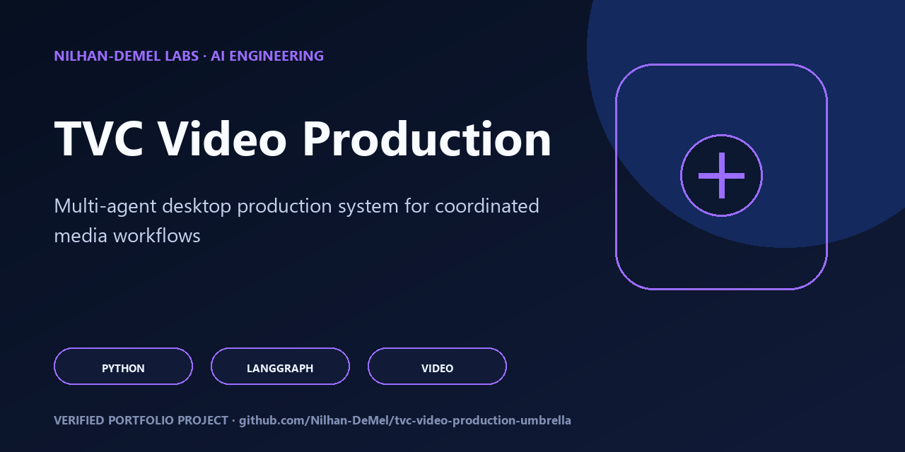

# TVC Umbrella Repo

<!-- portfolio-flagship -->
<p align="center"></p>

> **Portfolio review path:** Start with the capabilities and architecture below, then reproduce the documented verification commands. See [SECURITY.md](SECURITY.md), [CONTRIBUTING.md](CONTRIBUTING.md), and [RIGHTS.md](RIGHTS.md) for the project's operating and reuse boundaries.

TVC Studio Agent is a local-first, multi-stage AI media-production system with explicit writing, timing, audio, visual, editing, and verification stages.

> [!TIP]
> **Evaluating this project?** Start with the [Engineering Overview](ENGINEERING_OVERVIEW.md) for the architecture, guided code tour, verification model, agent entry points, and current boundaries.

This repo has exactly two product folders:

- `Video_production_agent/` - the canonical live TVC app
- `Video_production/` - archived reference code only

## Rules

- Launch, test, and edit the live app only from `Video_production_agent/`.
- Do not point shortcuts, launchers, CI, or operator docs at `Video_production/`.
- Keep `Video_production/` browseable for reference, but treat it as read-only historical context.

## Verification

From the umbrella root:

```powershell
powershell -ExecutionPolicy Bypass -File .\scripts\verify_active_app.ps1
```

That command:

- checks the live subtree for forbidden runtime references to `Video_production/`
- runs the active app test suite from `Video_production_agent/tests`

## Working Directory

Day-to-day app work should happen in:

`D:\AI-Apps-In-Drive\App_Station\tvc_umbrella_repo\Video_production_agent`
